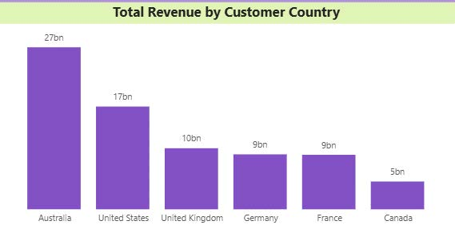
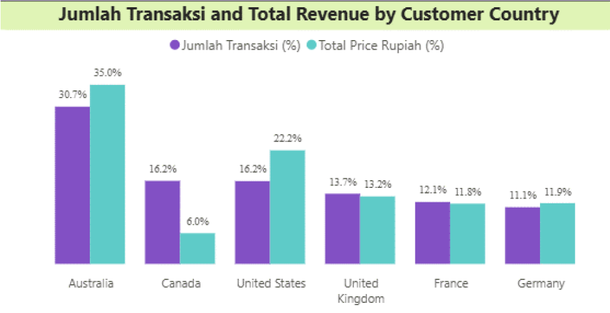
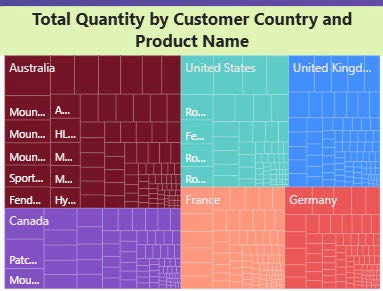
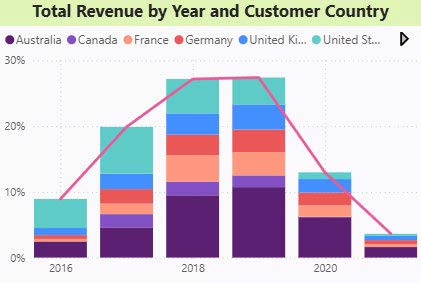
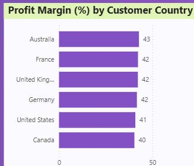

**Objective Analysis** : Analisis wilayah untuk mengidentifikasi area dengan performa penjualan terbaik dan peluang ekspansi.

**Pertanyaan Bisnis**:

1. Negara mana yang memiliki omset tertinggi?

**Wawasan** : Negara Australia menjadi negara yang memiliki total revenue tertinggi yaitu sekitar 27 billion atau 27 Miliar.

**Pengetahuan yang dapat ditindak lanjuti** : Memperkuat strategi marketing di Australia dengan melakukan campaign produk terlaris serta melakukan benchmarking strategi Australia ke negara lain untuk tetap meningkatkan revenue global

2. Apakah ada wilayah yang tinggi transaksi namun rendah revenue?

**Wawasan** : Canada Memiliki volume transaksi cukup besar (16.2%) namun hanya menghasilkan 6.0% revenue yang artinya nilai transaksi (basket size)rendah, kemungkinan produk tersebut memiliki harga yang murah.Sebaliknya, Australia memiliki revenue lebih tinggi dibandingkan proposi transaksinya yang artinya nilai transaksinya (basket size) lebih tinggi, kemungkinan produk tersebut mahal atau pelanggan membeli lebih banyak dalam satu transaksi.

**Pengetahuan yang dapat ditindak lanjuti** : Melakukan analisis produk yang terjual di Canada untuk mendeteksi basket size yang rendah, atau melakukan strategi upselling atau promo bundling di Kanada agar basket size meningkat.

3. Produk apa yang paling populer di tiap wilayah?

**Wawasan** : 
• Produk Water Bottle 30 oz menjadi produk paling populer di wilayah Australia, United Kingdom, France, dan Germany, menunjukkan produk ini memiliki permintaan tinggi secara konsisten di berbagai pasar Eropa dan Australia.
• Sementara itu, produk HL Mountain Tire sebagai produk paling populer di pasar United States. Di Canada, produk Road Tire Tube mendominasi penjualan, namun dari Chart 2 diketahui bahwa revenue Canada relatif rendah dibanding jumlah transaksinya, yang mungkin menunjukkan harga jual produk di pasar ini cenderung lebih murah.

**Pengetahuan yang dapat ditindak lanjuti** : 
Optimalkan campaign untuk Water Bottle 30 oz di negara-negara Eropa dan Australia. Analisis lebih lanjut margin Road Tire Tube di Canada dan evaluasi harga jual agar revenue meningkat.

4. Bagaimana tren penjualan per negara dari waktu ke waktu?

**Wawasan** : Secara keseluruham, tren revenue di semua negara mengalami peningkatan dari 2016 hingga 2018. Namun pada ta.hun 2019 hingga 2021 revenue perlahan-lahan mengalami penurunan secara proporsional, hal ini bisa disebabkan berbagai faktor, yaitu kondisi ekonomi global (kemungkinan efek pandemi), perubahan pola belanja konsumen, hingga persaingan semakin ketat.

**Pengetahuan yang dapat ditindaklanjuti** : Melakukan analisis mendalam terhadap penyebab penurunan revenue, evaluasi produk dan campaign hingga inovasi produk.

5. Negara mana yang memiliki margin keuntungan tertinggi?

**Wawasan** : Australia tidak hanya menjadi negara dengan revenue terbesar, tetapi juga mencatat profit margin tertinggi (43%), menunjukkan wilayah ini sangat potensial sebagai pasar premium. Sebaliknya, Kanada memiliki margin terendah (40%)

**Pengetahuan yang dapat ditindaklanjuti** : Fokus mempertahankan margin tinggi di Australia sambil mencari peluang cross-selling produk margin besar, lakukan analisis lebih lanjut di Canada untuk menaikkan harga jual agar margin naik.

